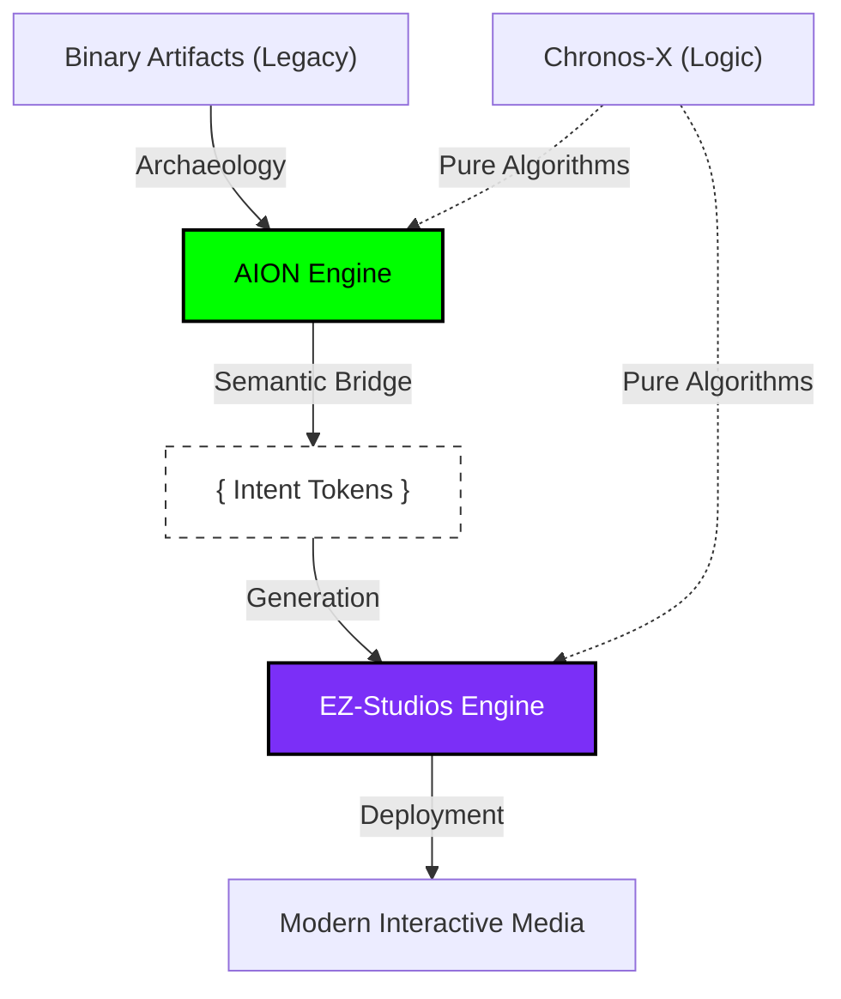

# EZ-Fundation: The Infinite Code Renaissance

> **Preserving Creative History. Seeding Procedural Futures.**

[**English**](profile/README.md) | [**Português**](profile/README_PT.md)

---

## 🏛️ Mission & Vision

> [!IMPORTANT]
> **EZ-Fundation** is a research and development collective dedicated to the **Isomorphic Preservation of Software**. We believe that code is the DNA of human creativity, and it shouldn't be lost to hardware obsolescence or digital decay.

Our mission is to build the **Universal Infrastructure of Creation**, where algorithms are prioritized over static assets, and logic is mathematically preserved for generations to come.

---

## 🔬 The "Symbeon" Protocol
The core of our organizational logic lies in the bridge between archaeology and creation.

  

## 💎 The Ecosystem Pillars

| Archaeology | Generation | Logic |
| :---: | :---: | :---: |
|  |  |  |
| [**AION-Core**](https://github.com/ez-fundation/aion-core) | [**EZ-Studios-Core**](https://github.com/ez-fundation/ez-studios-core) | [**Chronos-X**](https://github.com/ez-fundation/chronos-X) |
| *Decrypting the Past* | *Seeding the Future* | *Timeless Execution* |

---

## 🔬 The "Symbeon" Strategy
We utilize the **Symbeon Strategy** (Symbiotic Evolution) to bridge the gap between digital history and future creation:

1.  **Extract:** Recover core logic from legacy binaries using AION's Algebraic Analysis.
2.  **Bridge:** Transcribe findings into high-level "Intents".
3.  **Generate:** Deploy new, modernized interactive experiences via the EZ-Studios engine.

---

## 🤝 Join the Collective
We are looking for digital archaeologists, procedural architects, and mathematical dreamers.
- **Ethics:** Zero-waste creation. Algorithms over assets. Knowledge must be accessible.
- **Contributions:** Check individual repositories for contribution guidelines.

---

  <b>Built by EZ-Fundation</b> 
  <i>"In code we trust, in algorithms we evolve."</i>

