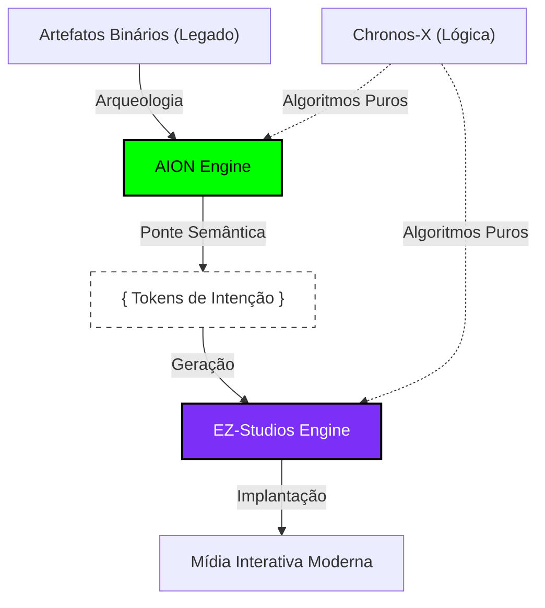

# EZ-Fundation: O Renascimento do Código Infinito

> **Preservando a História Criativa. Semeando Futuros Procedurais.**

[**English**](profile/README.md) | [**Português**](profile/README_PT.md)

---

## 🏛️ Missão & Visão
A EZ-Fundation é um coletivo de pesquisa e desenvolvimento dedicado à **Preservação Isomórfica de Software**. Acreditamos que o código é o DNA da criatividade humana e não deve ser perdido para a obsolescência de hardware ou decomposição digital.

Nossa missão é construir a **Infraestrutura Universal de Criação**, onde algoritmos são priorizados sobre ativos estáticos e a lógica é matematicamente preservada para as gerações futuras.

---

## 💎 Os Pilares do Ecossistema

| Arqueologia | Geração | Lógica |
| :---: | :---: | :---: |
|  |  |  |
| [**AION-Core**](https://github.com/ez-fundation/aion-core) | [**EZ-Studios-Core**](https://github.com/ez-fundation/ez-studios-core) | [**Chronos-X**](https://github.com/ez-fundation/chronos-X) |
| *Decifrando o Passado* | *Semeando o Futuro* | *Execução Atemporal* |

---

## 🔬 A Estratégia "Symbeon"
Utilizamos a **Estratégia Symbeon** (Evolução Simbiótica) para unir a história digital com a criação futura:

1.  **Extração:** Recuperar lógica core de binários legados usando a Análise Algébrica do AION.
2.  **Ponte:** Transcrever as descobertas em "Intenções" de alto nível.
3.  **Geração:** Implementar novas experiências interativas modernas via motor EZ-Studios.

---

## 🤝 Junte-se ao Coletivo
Buscamos arqueólogos digitais, arquitetos procedurais e sonhadores matemáticos.
- **Ética:** Criação sem desperdício. Algoritmos sobre assets. O conhecimento deve ser acessível.
- **Contribuições:** Verifique os repositórios individuais para diretrizes de contribuição.

---

  <b>Construído pela EZ-Fundation</b> 
  <i>"No código confiamos, nos algoritmos evoluímos."</i>

